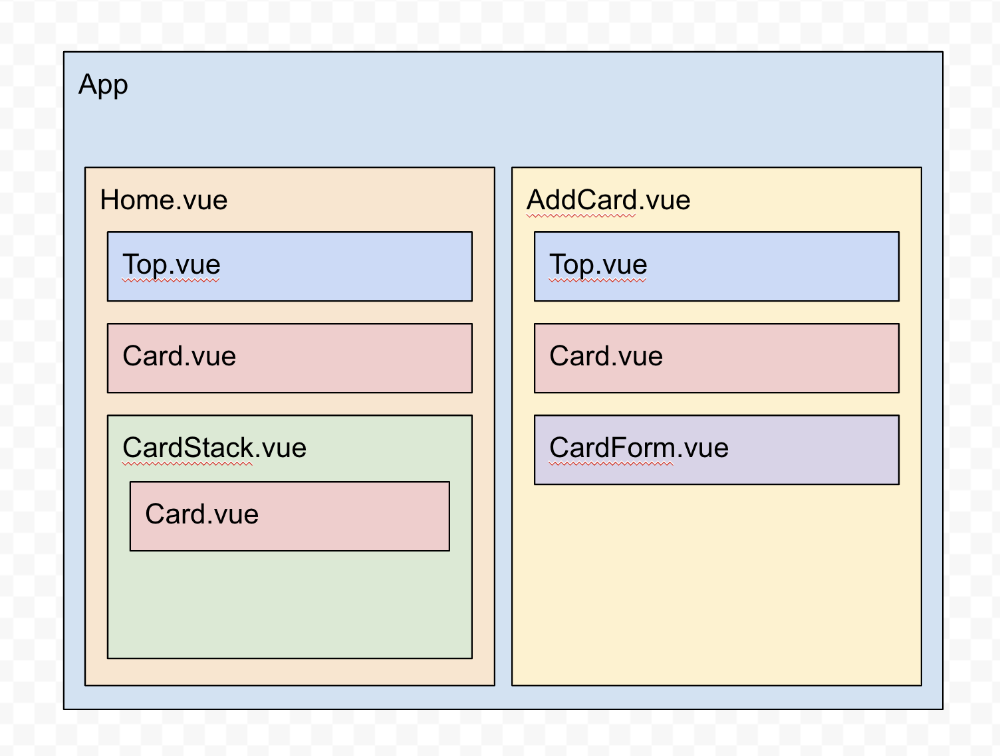

# Inlämningsuppgift 1 - E-wallet

Du ska bygga en digital plånbok som samlar alla kreditkort. Det ska gå och se sina kreditkort samt lägga till ett nytt.


**Figmaskiss:** https://www.figma.com/file/G4ep4nWFUplM8kXEntq83C/E-Wallet?node-id=11%3A2

## Instruktioner

**För att få Godkänt ska du:**
* Ha gjort uppgiften med ```vue create```
* Gjort enligt Figma skissen (det behöver inte vara exakt enligt design)
* Det är en single file application (SPA) som använder ```vue-router```
* Kan komma något mer i veckan

**För att Väl Godkänt ska du:**
* Kommer uppdatera här i veckan


### Komponentarkitektur


